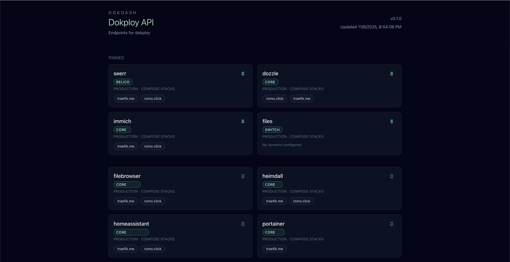

# Dokdash



Dokdash is a lightweight, Bun-powered dashboard that surfaces the projects and services deployed on your Dokploy instance. It talks to Dokploy’s OpenAPI, groups deployments by project, and gives you quick access to each published domain.

## Highlights

- Fetches data server-side with Bun to avoid CORS issues.
- Displays projects, environments, and deployment links in a clean, responsive layout.
- Lets you pin frequently used services; pinned items appear at the top and persist in local storage.
- Uses tailwind + shadcn/ui for minimal styling without extra dependencies.

## Getting Started

1. Install dependencies.
   ```bash
   bun install
   ```
2. Set Dokploy credentials (for example in `.env`):
   ```
   DOKPLOY_BASE_URL=https://your-dokploy-host/api
   DOKPLOY_API_KEY=your-token
   ```
3. Run the dev server.
   ```bash
   bun dev
   ```
4. Open the app (default `http://localhost:3000`) and explore.

## Docker

Use `docker-compose`:

```yaml
services:
  dokdash:
    image: ghcr.io/wovalle/dokdash:latest
    restart: unless-stopped
    ports:
      - "3000:3000"
    environment:
      DOKPLOY_BASE_URL: https://your-dokploy-host
      DOKPLOY_API_KEY: dokploy-api-token # https://docs.dokploy.com/docs/api
```
